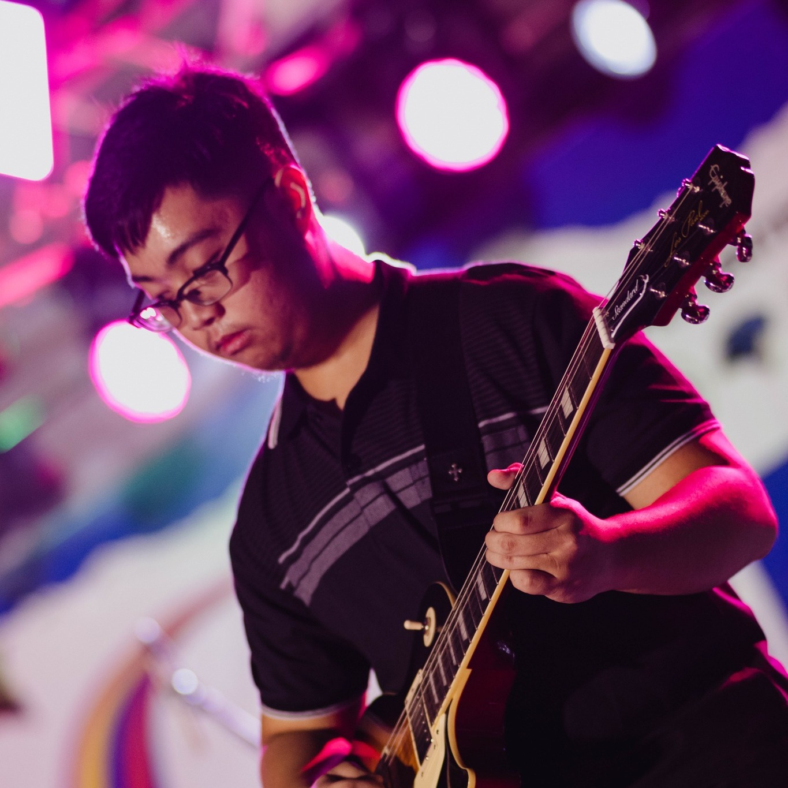

# 🌐 7OOP Projects  

---

## 📖 About Me  

👋 Hello, I'm **Daniel Robert Buccat**  
🎓 A 2nd Year Computer Science Student at [**City College of Angeles (CCA)**](https://www.facebook.com/CityCollegeOfAngeles)  

 

---

## 🎯 Areas of Interest  
- 💻 Web Development
- 🎮 Game Development  
- 📱 Mobile App Development  

---

## 💡 Programming Languages I Know  
- 🐍 Python  
- ☕ Java  
- 🌐 HTML, CSS
- 🖥️ C
- 🐘 PHP  
- 📊 SQL  

---

## 🚀 Featured Projects  
- [Project 1](#)  
- [Project 2](#)  
- [Project 3](#)

---

## 🎉 Fun Facts About Me  
- 🎮 Gamer at heart 🎸 Guitar enthusiast  
- 🎥 Love making YouTube content  
- ✨ Curious learner, always exploring new things  

---

## 📫 Connect With Me  
- 📧 [Email Me](mailto:dbuccat24-0032@cca.edu.ph)  
- 👍 [Facebook](https://www.facebook.com/danielrobbuccat/)  
- 📸 [Instagram](https://www.instagram.com/danielrobbuccat/)  
- ▶️ [YouTube](https://youtube.com/@DanroTheGamer)  
- 🎵 [TikTok](https://www.tiktok.com/@danielrobertbuccat)  
